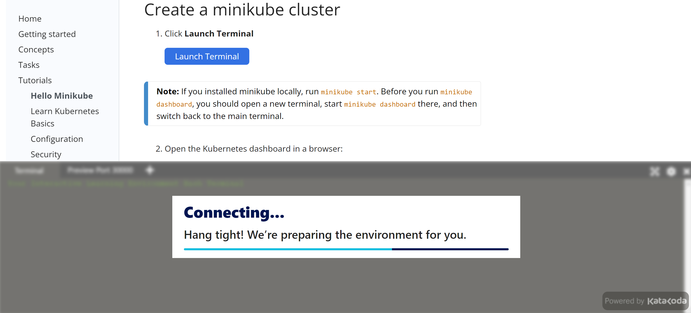
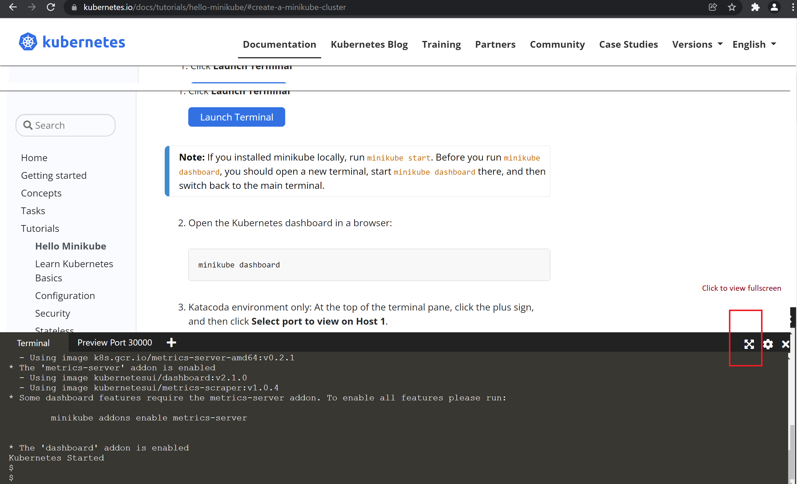
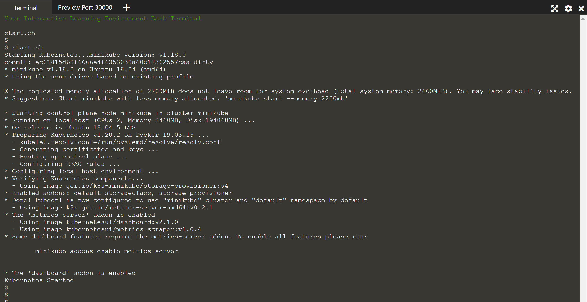
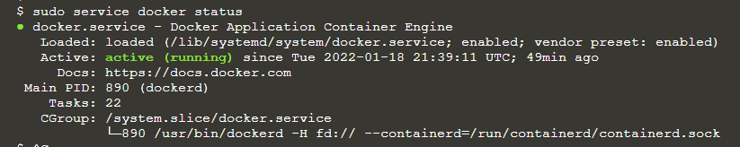
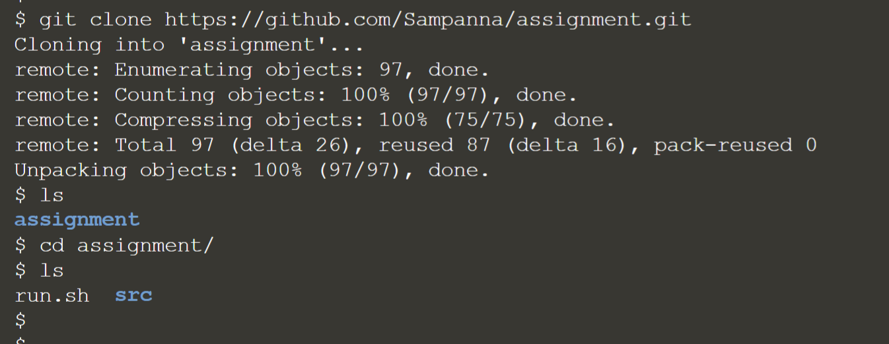

# Assignment

## Mini Kube

Write a simple hello world application in any one of these languages: Python, Ruby, Go. Build the application within a Docker container and then load balance the application within Minikube. You are not required to automate the installation of Minikube on the host machine.

## Approach

In order to keep the solution simple as possible, there were few assumptions made based on the requirements provided.

This solution uses :

1. Python
1. Flask webserver framework
1. Docker
1. Git 
1. Online MiniKube terminal 
1. Shell script
1. Platform Linux (OS - Ubuntu)
  
### Assumptions

1. Internet is available and one can reach github endpoints to clone the code.
1. One can use https://kubernetes.io/docs/tutorials/hello-minikube/#create-a-minikube-cluster online terminal.
1. MiniKube is already set up and started.
1. Kubernetes cluster started.
1. kubectl is installed; min version 1.20.2.
1. Docker is installed, the deamon is up and running. 
1. Git is intalled and enabled.
1. One can use Python image of their choice.
1. One can use web server framework of their choice.

---
**NOTE**

Installation of any of the above components is out of scope.

At the time the code was written, below were the versions

| Content       | Version             | 
| ------------- |:--------------------| 
| minikube      | v1.18.0             | 
| OS release    | Ubuntu 18.04.5 LTS  | 
| Kubernetes    | v1.20.2             |   
| Docker        | 19.03.13            |    


---
## Solution

Directory structure

```
assignment
|--src
|    |--app
|    |    |--app.py         # application
|    |    |--Dockerfile     # Docker file
|    |--k8s 
|    |   |--deployment.yaml # deployment to create a replicaset
|    |   |--svc.yaml        # service
|    |--readme
|    |   |readme.md
|    |   |--images
|    |   |    *.png
|run.sh

```


##  How to set up the app

This article shows how to set up the app using online terminal for MiniKube

1. Go to https://kubernetes.io/docs/tutorials/hello-minikube/#create-a-minikube-cluster and launch MiniKube terminal (refer screenshot below)
   


Wait till it opens the terminal

 

This opens a small pane towards the bottom of the page. Please wait till you see the message 'Kubernetes started' as highligted below.


To view terminal in fullscreen, please click the 'fullscreen' (and not the 'x' to close the terminal) icon on the top right corner of the terminal as highlighted below



Expanded termnial in full screen looks like below



Proceed by following rest of steps by running commands in the terminal

Ensure docker daemon service is up and running by running below command. 

```
sudo service docker status

```



If docker service is not running, run below command to start the service

```
sudo service docker start

```

Run command 

```

git clone https://github.com/Sampanna/assignment.git	

```
This will pull all the required files from GitHub.  




## How to run the app

Once the code is available, navigate to 'assignment' directory. 

```
cd assignment

```
Once inside 'assignment' directory run 'run.sh' command as highlighted below

```
sh run.sh

```
  
Series of commands in run.sh file will take a bit to get all the components ready.  Please ignore warnings related to 'pip version'

**NOTE**  

Note1:    

*run.sh* file contains a list of commands to create docker image, create replicaset and service required for the app to run. Once all the required components are in place, it then sends a http request using curl to get 'Hello World!' displayed on the console. One can choose to run these commands one after the other in the same sequence if they wish to.
 
Note2:    

The image built using docker is available locally hence the 'imagePullPolicy' is set to Never in the deployment.yaml file.

----

Outputs from 'sh run.sh' (few lines of the output truncated for briverty)


Wait for terminal to return till you see 'Hello World!' message (highlighted below). 


---

## Entire output from run.sh

```

Sending build context to Docker daemon  3.072kB
Step 1/9 : FROM python:3
3: Pulling from library/python
0e29546d541c: Pulling fs layer
9b829c73b52b: Pulling fs layer
cb5b7ae36172: Pulling fs layer
6494e4811622: Pulling fs layer
6f9f74896dfa: Pulling fs layer
fcb6d5f7c986: Pulling fs layer
3445db4c939c: Pulling fs layer
def920d3ef5d: Pulling fs layer
aabf25a1ee4b: Pulling fs layer
6494e4811622: Waiting
6f9f74896dfa: Waiting
fcb6d5f7c986: Waiting
3445db4c939c: Waiting
def920d3ef5d: Waiting
aabf25a1ee4b: Waiting
9b829c73b52b: Verifying Checksum
9b829c73b52b: Download complete
cb5b7ae36172: Verifying Checksum
cb5b7ae36172: Download complete
0e29546d541c: Verifying Checksum
0e29546d541c: Download complete
fcb6d5f7c986: Retrying in 5 seconds
6494e4811622: Verifying Checksum
6494e4811622: Download complete
3445db4c939c: Verifying Checksum
3445db4c939c: Download complete
def920d3ef5d: Verifying Checksum
def920d3ef5d: Download complete
fcb6d5f7c986: Retrying in 4 seconds
aabf25a1ee4b: Verifying Checksum
aabf25a1ee4b: Download complete
fcb6d5f7c986: Retrying in 3 seconds
fcb6d5f7c986: Retrying in 2 seconds
6f9f74896dfa: Verifying Checksum
6f9f74896dfa: Download complete
fcb6d5f7c986: Retrying in 1 second
fcb6d5f7c986: Retrying in 10 seconds
fcb6d5f7c986: Retrying in 9 seconds
0e29546d541c: Pull complete
fcb6d5f7c986: Retrying in 8 seconds
9b829c73b52b: Pull complete
cb5b7ae36172: Pull complete
fcb6d5f7c986: Retrying in 7 seconds
fcb6d5f7c986: Retrying in 6 seconds
fcb6d5f7c986: Retrying in 5 seconds
fcb6d5f7c986: Retrying in 4 seconds
6494e4811622: Pull complete
fcb6d5f7c986: Retrying in 3 seconds
fcb6d5f7c986: Retrying in 2 seconds
fcb6d5f7c986: Retrying in 1 second
fcb6d5f7c986: Retrying in 15 seconds
fcb6d5f7c986: Retrying in 14 seconds
fcb6d5f7c986: Retrying in 13 seconds
fcb6d5f7c986: Retrying in 12 seconds
fcb6d5f7c986: Retrying in 11 seconds
fcb6d5f7c986: Retrying in 10 seconds
fcb6d5f7c986: Retrying in 9 seconds
fcb6d5f7c986: Retrying in 8 seconds
fcb6d5f7c986: Retrying in 7 seconds
fcb6d5f7c986: Retrying in 6 seconds
fcb6d5f7c986: Retrying in 5 seconds
6f9f74896dfa: Pull complete
fcb6d5f7c986: Retrying in 4 seconds
fcb6d5f7c986: Retrying in 3 seconds
fcb6d5f7c986: Retrying in 2 seconds
fcb6d5f7c986: Retrying in 1 second
fcb6d5f7c986: Retrying in 20 seconds
fcb6d5f7c986: Retrying in 19 seconds
fcb6d5f7c986: Retrying in 18 seconds
fcb6d5f7c986: Retrying in 17 seconds
fcb6d5f7c986: Retrying in 16 seconds
fcb6d5f7c986: Retrying in 15 seconds
fcb6d5f7c986: Retrying in 14 seconds
fcb6d5f7c986: Retrying in 13 seconds
fcb6d5f7c986: Retrying in 12 seconds
fcb6d5f7c986: Retrying in 11 seconds
fcb6d5f7c986: Retrying in 10 seconds
fcb6d5f7c986: Retrying in 9 seconds
fcb6d5f7c986: Retrying in 8 seconds
fcb6d5f7c986: Retrying in 7 seconds
fcb6d5f7c986: Retrying in 6 seconds
fcb6d5f7c986: Retrying in 5 seconds
fcb6d5f7c986: Retrying in 4 seconds
fcb6d5f7c986: Retrying in 3 seconds
fcb6d5f7c986: Retrying in 2 seconds
fcb6d5f7c986: Retrying in 1 second
fcb6d5f7c986: Downloading
3: Pulling from library/python
0e29546d541c: Pulling fs layer
9b829c73b52b: Pulling fs layer
cb5b7ae36172: Pulling fs layer
6494e4811622: Pulling fs layer
6f9f74896dfa: Pulling fs layer
fcb6d5f7c986: Pulling fs layer
3445db4c939c: Pulling fs layer
def920d3ef5d: Pulling fs layer
aabf25a1ee4b: Pulling fs layer
6494e4811622: Waiting
6f9f74896dfa: Waiting
fcb6d5f7c986: Waiting
3445db4c939c: Waiting
def920d3ef5d: Waiting
aabf25a1ee4b: Waiting
9b829c73b52b: Verifying Checksum
9b829c73b52b: Download complete
cb5b7ae36172: Verifying Checksum
cb5b7ae36172: Download complete
0e29546d541c: Verifying Checksum
0e29546d541c: Download complete
fcb6d5f7c986: Verifying Checksum
fcb6d5f7c986: Download complete
6494e4811622: Verifying Checksum
6494e4811622: Download complete
def920d3ef5d: Verifying Checksum
def920d3ef5d: Download complete
3445db4c939c: Verifying Checksum
3445db4c939c: Download complete
aabf25a1ee4b: Verifying Checksum
aabf25a1ee4b: Download complete
6f9f74896dfa: Verifying Checksum
6f9f74896dfa: Download complete
0e29546d541c: Pull complete
9b829c73b52b: Pull complete
cb5b7ae36172: Pull complete
6494e4811622: Pull complete
6f9f74896dfa: Pull complete
fcb6d5f7c986: Pull complete
3445db4c939c: Pull complete
def920d3ef5d: Pull complete
aabf25a1ee4b: Pull complete
Digest: sha256:f09d764ee8e6158cddfab341f442fd2e59acd99c4ed5b493a69e55944c379c05
Status: Downloaded newer image for python:3
 ---> cecf555903c6
Step 2/9 : ENV VIRTUAL_ENV=/opt/venv
 ---> Running in 5206631aa546
Removing intermediate container 5206631aa546
 ---> 3a4e64e9ef87
Step 3/9 : RUN python3 -m venv $VIRTUAL_ENV
 ---> Running in a82d8cb5b6a2
Removing intermediate container a82d8cb5b6a2
 ---> 056d437cb5c8
Step 4/9 : ENV PATH="$VIRTUAL_ENV/bin:$PATH"
 ---> Running in cfb075887b7b
Removing intermediate container cfb075887b7b
 ---> c90b99369707
Step 5/9 : ADD app.py /
 ---> 67fd987415de
Step 6/9 : RUN pip install flask
 ---> Running in 54c0b65e97d4
Collecting flask
  Downloading Flask-2.0.2-py3-none-any.whl (95 kB)
Collecting Jinja2>=3.0
  Downloading Jinja2-3.0.3-py3-none-any.whl (133 kB)
Collecting click>=7.1.2
  Downloading click-8.0.3-py3-none-any.whl (97 kB)
Collecting itsdangerous>=2.0
  Downloading itsdangerous-2.0.1-py3-none-any.whl (18 kB)
Collecting Werkzeug>=2.0
  Downloading Werkzeug-2.0.2-py3-none-any.whl (288 kB)
Collecting MarkupSafe>=2.0
  Downloading MarkupSafe-2.0.1-cp310-cp310-manylinux_2_5_x86_64.manylinux1_x86_64.manylinux_2_12_x86_64.manylinux2010_x86_64.whl (30 kB)
Installing collected packages: MarkupSafe, Werkzeug, Jinja2, itsdangerous, click, flask
Successfully installed Jinja2-3.0.3 MarkupSafe-2.0.1 Werkzeug-2.0.2 click-8.0.3 flask-2.0.2 itsdangerous-2.0.1
WARNING: You are using pip version 21.2.4; however, version 21.3.1 is available.
You should consider upgrading via the '/opt/venv/bin/python3 -m pip install --upgrade pip' command.
Removing intermediate container 54c0b65e97d4
 ---> e78bb6fa6a26
Step 7/9 : RUN pip install flask_restful
 ---> Running in f58fb6c0dee6
Collecting flask_restful
  Downloading Flask_RESTful-0.3.9-py2.py3-none-any.whl (25 kB)
Collecting six>=1.3.0
  Downloading six-1.16.0-py2.py3-none-any.whl (11 kB)
Requirement already satisfied: Flask>=0.8 in /opt/venv/lib/python3.10/site-packages (from flask_restful) (2.0.2)
Collecting pytz
  Downloading pytz-2021.3-py2.py3-none-any.whl (503 kB)
Collecting aniso8601>=0.82
  Downloading aniso8601-9.0.1-py2.py3-none-any.whl (52 kB)
Requirement already satisfied: click>=7.1.2 in /opt/venv/lib/python3.10/site-packages (from Flask>=0.8->flask_restful) (8.0.3)
Requirement already satisfied: itsdangerous>=2.0 in /opt/venv/lib/python3.10/site-packages (from Flask>=0.8->flask_restful) (2.0.1)
Requirement already satisfied: Jinja2>=3.0 in /opt/venv/lib/python3.10/site-packages (from Flask>=0.8->flask_restful) (3.0.3)
Requirement already satisfied: Werkzeug>=2.0 in /opt/venv/lib/python3.10/site-packages (from Flask>=0.8->flask_restful) (2.0.2)
Requirement already satisfied: MarkupSafe>=2.0 in /opt/venv/lib/python3.10/site-packages (from Jinja2>=3.0->Flask>=0.8->flask_restful) (2.0.1)
Installing collected packages: six, pytz, aniso8601, flask-restful
Successfully installed aniso8601-9.0.1 flask-restful-0.3.9 pytz-2021.3 six-1.16.0
WARNING: You are using pip version 21.2.4; however, version 21.3.1 is available.
You should consider upgrading via the '/opt/venv/bin/python3 -m pip install --upgrade pip' command.
Removing intermediate container f58fb6c0dee6
 ---> 92f22ed242e5
Step 8/9 : EXPOSE 3434
 ---> Running in 5d6a96cd17f0
Removing intermediate container 5d6a96cd17f0
 ---> 61472e42f458
Step 9/9 : CMD [ "python", "./app.py"]
 ---> Running in 35c8cb378247
Removing intermediate container 35c8cb378247
 ---> c0514519c353
Successfully built c0514519c353
Successfully tagged hello_world:latest
deployment.apps/helloworld created
service/helloworldservice created
NAME                          READY   STATUS              RESTARTS   AGE
helloworld-7c7c8b4564-gkcxd   0/1     ContainerCreating   0          0s
helloworld-7c7c8b4564-rls9c   0/1     ContainerCreating   0          0s
NAME                TYPE           CLUSTER-IP     EXTERNAL-IP   PORT(S)          AGE
helloworldservice   LoadBalancer   10.96.114.75   <pending>     8080:31092/TCP   0s
kubernetes          ClusterIP      10.96.0.1      <none>        443/TCP          2m23s
Hello World!$ 
$ 
$ 

```

If you want to send a webrequest again, run below commands

```
## Get the IP for the service created
CLUSTER_IP=$(kubectl get svc helloworldservice -ojsonpath='{.spec.clusterIP}')

## Curl the service endpoint
curl http://$CLUSTER_IP:8080

```

---
**MISC**  

### How to find if docker daemon is running.

Run below command on your terminal to get the process id for dockerd

```
pid=$(cat /var/run/docker.pid)

top -p $pid

```