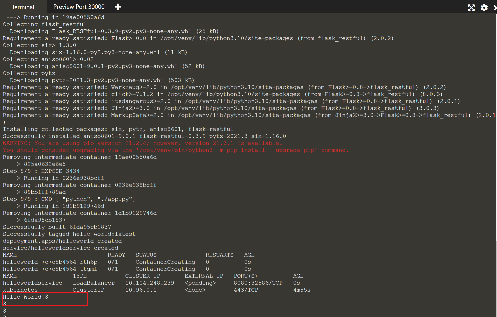

# Assignment

## Mini Kube

Write a simple hello world application in any one of these languages: Python, Ruby, Go. Build the application within a Docker container and then load balance the application within Minikube. You are not required to automate the installation of Minikube on the host machine.

## Approach

In order to keep the solution simple as possible, there were few assumptions made based on the requirements provided.

This solution uses :

1. Python
1. Flask webserver framework
1. Docker
1. Git 
1. Online MiniKube terminal 
1. Shell script
1. Platform Linux (OS - Ubuntu)
  
### Assumptions

1. Use https://kubernetes.io/docs/tutorials/hello-minikube/#create-a-minikube-cluster online terminal
1. MiniKube is already set up and started
1. Kubernetes cluster started.
1. kubectl is installed; min version 1.20.2.
1. Docker is installed, the deamon is up and running. 
1. Git is enabled.
1. Use Python image of your choice.
1. Use web server framework of your choice.

---
**NOTE**

Installation of any of the above components is out of scope.

At the time the code was written, below were the versions

| Content       | Version             | 
| ------------- |:--------------------| 
| minikube      | v1.18.0             | 
| OS release    | Ubuntu 18.04.5 LTS  | 
| Kubernetes    | v1.20.2             |   
| Docker        | 19.03.13            |    


---
## Solution

Directory structure

```
assignment
|--src
|    |--app
|    |    |--app.py     # application
|    |    |--Dockerfile # Docker file
|    |--k8s 
|    |   |--deployment.yaml # deployment to create a replicaset
|    |   |--svc.yaml        # service
|    |--readme
|    |   |readme.md
|    |   |--images
|    |   |    *.png
|run.sh

```


##  How to set up the app

This article shows how to set up the app using online terminal for MiniKube

1. Go to https://kubernetes.io/docs/tutorials/hello-minikube/#create-a-minikube-cluster and launch MiniKube terminal
   


Wait till you see the message 'Kubernetes started'


Ensure docker daemon service is up and running by running below command. 

```
sudo service docker status

```


If docker service is not running, run below command to start the service

```
sudo service docker start

```

Run command 

```

git clone https://github.com/Sampanna/assignment.git	

```
This will pull all the required files from GitHub.  

## How to run the app

Once the code is available, navigate to 'assignment' directory. 

```
cd assignment

```
Once inside 'assignment' directory run 'run.sh' command as highlighted below

```
sh run.sh

```
  
Series of commands in run.sh file will take a bit to get all the components ready.   

---
**NOTE**  

The image built using docker is available locally hence the 'imagePullPolicy' is set to Never in the deployment.yaml file.
----


Wait for terminal to return till you see 'Hello World!' message (below)



---
**NOTE**  

*run.sh* file contains a list of commands to create docker image, create replicaset and service required for the app to run. Once all the required components are in place, it then sends a http request using curl to get 'Hello World!' displayed on the console. One can choose to run these commands one after the other in the same sequence if they wish to.
---  


## Output from run.sh

```

Sending build context to Docker daemon  3.072kB
Step 1/9 : FROM python:3
3: Pulling from library/python
0e29546d541c: Pulling fs layer
9b829c73b52b: Pulling fs layer
cb5b7ae36172: Pulling fs layer
6494e4811622: Pulling fs layer
6f9f74896dfa: Pulling fs layer
fcb6d5f7c986: Pulling fs layer
290438add9da: Pulling fs layer
ab11df61f44a: Pulling fs layer
de4793a5fa46: Pulling fs layer
6494e4811622: Waiting
6f9f74896dfa: Waiting
fcb6d5f7c986: Waiting
290438add9da: Waiting
ab11df61f44a: Waiting
de4793a5fa46: Waiting
9b829c73b52b: Verifying Checksum
9b829c73b52b: Download complete
cb5b7ae36172: Verifying Checksum
cb5b7ae36172: Download complete
0e29546d541c: Verifying Checksum
0e29546d541c: Download complete
fcb6d5f7c986: Verifying Checksum
fcb6d5f7c986: Download complete
290438add9da: Verifying Checksum
290438add9da: Download complete
ab11df61f44a: Verifying Checksum
ab11df61f44a: Download complete
de4793a5fa46: Verifying Checksum
de4793a5fa46: Download complete
6494e4811622: Verifying Checksum
6494e4811622: Download complete
6f9f74896dfa: Verifying Checksum
6f9f74896dfa: Download complete
0e29546d541c: Pull complete
9b829c73b52b: Pull complete
cb5b7ae36172: Pull complete
6494e4811622: Pull complete
6f9f74896dfa: Pull complete
fcb6d5f7c986: Pull complete
290438add9da: Pull complete
ab11df61f44a: Pull complete
de4793a5fa46: Pull complete
Digest: sha256:dbbfcbf95f6b596d2be1d8f3b368016619f78f829facf6f2e361bea1151794e5
Status: Downloaded newer image for python:3
 ---> a5d7930b60cc
Step 2/9 : ENV VIRTUAL_ENV=/opt/venv
 ---> Running in 3b737caedf54
Removing intermediate container 3b737caedf54
 ---> 86a1a338ce40
Step 3/9 : RUN python3 -m venv $VIRTUAL_ENV
 ---> Running in 0a95c5983348
Removing intermediate container 0a95c5983348
 ---> 85f357aea12f
Step 4/9 : ENV PATH="$VIRTUAL_ENV/bin:$PATH"
 ---> Running in 9ee230ea7a77
Removing intermediate container 9ee230ea7a77
 ---> c73828f43c3d
Step 5/9 : ADD app.py /
 ---> 27f0e0d9bb7d
Step 6/9 : RUN pip install flask
 ---> Running in c301decc3679
Collecting flask
  Downloading Flask-2.0.2-py3-none-any.whl (95 kB)
Collecting click>=7.1.2
  Downloading click-8.0.3-py3-none-any.whl (97 kB)
Collecting itsdangerous>=2.0
  Downloading itsdangerous-2.0.1-py3-none-any.whl (18 kB)
Collecting Jinja2>=3.0
  Downloading Jinja2-3.0.3-py3-none-any.whl (133 kB)
Collecting Werkzeug>=2.0
  Downloading Werkzeug-2.0.2-py3-none-any.whl (288 kB)
Collecting MarkupSafe>=2.0
  Downloading MarkupSafe-2.0.1-cp310-cp310-manylinux_2_5_x86_64.manylinux1_x86_64.manylinux_2_12_x86_64.manylinux2010_x86_64.whl (30 kB)
Installing collected packages: MarkupSafe, Werkzeug, Jinja2, itsdangerous, click, flask
Successfully installed Jinja2-3.0.3 MarkupSafe-2.0.1 Werkzeug-2.0.2 click-8.0.3 flask-2.0.2 itsdangerous-2.0.1
WARNING: You are using pip version 21.2.4; however, version 21.3.1 is available.
You should consider upgrading via the '/opt/venv/bin/python3 -m pip install --upgrade pip' command.
Removing intermediate container c301decc3679
 ---> 318aec946564
Step 7/9 : RUN pip install flask_restful
 ---> Running in 3ab940a858a5
Collecting flask_restful
  Downloading Flask_RESTful-0.3.9-py2.py3-none-any.whl (25 kB)
Requirement already satisfied: Flask>=0.8 in /opt/venv/lib/python3.10/site-packages (from flask_restful) (2.0.2)
Collecting aniso8601>=0.82
  Downloading aniso8601-9.0.1-py2.py3-none-any.whl (52 kB)
Collecting six>=1.3.0
  Downloading six-1.16.0-py2.py3-none-any.whl (11 kB)
Collecting pytz
  Downloading pytz-2021.3-py2.py3-none-any.whl (503 kB)
Requirement already satisfied: itsdangerous>=2.0 in /opt/venv/lib/python3.10/site-packages (from Flask>=0.8->flask_restful) (2.0.1)
Requirement already satisfied: click>=7.1.2 in /opt/venv/lib/python3.10/site-packages (from Flask>=0.8->flask_restful) (8.0.3)
Requirement already satisfied: Jinja2>=3.0 in /opt/venv/lib/python3.10/site-packages (from Flask>=0.8->flask_restful) (3.0.3)
Requirement already satisfied: Werkzeug>=2.0 in /opt/venv/lib/python3.10/site-packages (from Flask>=0.8->flask_restful) (2.0.2)
Requirement already satisfied: MarkupSafe>=2.0 in /opt/venv/lib/python3.10/site-packages (from Jinja2>=3.0->Flask>=0.8->flask_restful) (2.0.1)
Installing collected packages: six, pytz, aniso8601, flask-restful
Successfully installed aniso8601-9.0.1 flask-restful-0.3.9 pytz-2021.3 six-1.16.0
WARNING: You are using pip version 21.2.4; however, version 21.3.1 is available.
You should consider upgrading via the '/opt/venv/bin/python3 -m pip install --upgrade pip' command.
Removing intermediate container 3ab940a858a5
 ---> b92df1370163
Step 8/9 : EXPOSE 3434
 ---> Running in 1ea8e5c51d70
Removing intermediate container 1ea8e5c51d70
 ---> 36fd067a4b0d
Step 9/9 : CMD [ "python", "./app.py"]
 ---> Running in 9d0bde4cbae9
Removing intermediate container 9d0bde4cbae9
 ---> e867b093d274
Successfully built e867b093d274
Successfully tagged hello_world:latest
deployment.apps/helloworld created
service/helloworldservice created
NAME                          READY   STATUS              RESTARTS   AGE
helloworld-7c7c8b4564-fqhzn   0/1     ContainerCreating   0          0s
helloworld-7c7c8b4564-qdvm2   0/1     ContainerCreating   0          0s
NAME                TYPE           CLUSTER-IP      EXTERNAL-IP   PORT(S)          AGE
helloworldservice   LoadBalancer   10.106.99.237   <pending>     8080:32489/TCP   0s
kubernetes          ClusterIP      10.96.0.1       <none>        443/TCP          2m33s
Hello World!

```

If you want to send a webrequest again, run below commands

```
## Get the IP for the service created
CLUSTER_IP=$(kubectl get svc helloworldservice -ojsonpath='{.spec.clusterIP}')

## Curl the service endpoint
curl http://$CLUSTER_IP:8080

```

---
**MISC**  

### How to find if docker daemon is running.

Run below command on your terminal to get the process id for dockerd

```
pid=$(cat /var/run/docker.pid)

top -p $pid

```